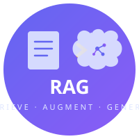

<!--lint disable awesome-heading awesome-github-badge-url awesome-git-repo-age-->

<!-- title -->

# Awesome RAG 

<!-- image -->

<!-- subtitle -->

A curated list of awesome tools, frameworks, and resources for Retrieval Augmented Generation (RAG).

<!-- description -->

RAG is a technique that enhances large language models by retrieving relevant information from external knowledge sources before generating responses, improving accuracy and reducing hallucinations.

<!-- TOC -->

## Contents

- [Frameworks](#frameworks)
- [Vector Databases](#vector-databases)
- [Embedding Models](#embedding-models)
- [Rerankers](#rerankers)
- [Chunking and Parsing](#chunking-and-parsing)
- [Evaluation](#evaluation)
- [Orchestration](#orchestration)
- [Tutorials and Courses](#tutorials-and-courses)
- [Papers](#papers)

## Frameworks

- [Canopy](https://github.com/pinecone-io/canopy) - RAG framework built on top of Pinecone for building chat assistants with context retrieval.
- [Cognita](https://github.com/truefoundry/cognita) - Open-source modular RAG framework for building production-grade applications with a no-code UI.
- [Embedchain](https://github.com/embedchain/embedchain) - Framework for creating RAG applications over any dataset with a simple API.
- [FastRAG](https://github.com/IntelLabs/fastRAG) - Research framework for efficient retrieval augmented generation by Intel Labs.
- [FlashRAG](https://github.com/RUC-NLPIR/FlashRAG) - Modular toolkit for reproducing and developing RAG research with pre-built pipelines.
- [Haystack](https://github.com/deepset-ai/haystack) - Modular framework for building production-ready NLP pipelines with components for retrieval, question answering, and summarization.
- [LangChain](https://github.com/langchain-ai/langchain) - Framework for building context-aware reasoning applications with composable components and 50k+ integrations.
- [LlamaIndex](https://github.com/run-llama/llama_index) - Data framework for connecting LLMs with external data sources, with 150+ data connectors and specialized indexing strategies.
- [Pathway](https://github.com/pathwaycom/pathway) - Data processing framework for real-time RAG pipelines with live document synchronization.
- [R2R](https://github.com/SciPhi-AI/R2R) - Production-ready RAG engine with built-in auth, ingestion, search, and management APIs.
- [RAGFlow](https://github.com/infiniflow/ragflow) - Open-source RAG engine with deep document understanding and visual workflow builder for complex document extraction.
- [Verba](https://github.com/weaviate/Verba) - Golden RAGtriever application built on top of Weaviate for end-to-end RAG pipelines.

## Vector Databases

- [Chroma](https://github.com/chroma-core/chroma) - Developer-friendly open-source embedding database for building AI applications.
- [LanceDB](https://github.com/lancedb/lancedb) - Serverless vector database with persistent storage and native multi-modal support.
- [Marqo](https://github.com/marqo-ai/marqo) - Tensor search engine with built-in vectorization for images and text.
- [Milvus](https://github.com/milvus-io/milvus) - Open-source vector database built for billion-scale similarity search with multiple index types.
- [pgvector](https://github.com/pgvector/pgvector) - Open-source vector similarity search extension for PostgreSQL.
- [Pinecone](https://www.pinecone.io/) - Fully managed vector database with low-latency similarity search and enterprise-grade scalability.
- [Qdrant](https://github.com/qdrant/qdrant) - High-performance vector similarity search engine written in Rust with advanced filtering.
- [Turbopuffer](https://turbopuffer.com/) - Serverless vector database optimized for low-cost, high-performance workloads.
- [Vespa](https://github.com/vespa-engine/vespa) - Big data serving engine supporting vector search, structured search, and ranking in one system.
- [Weaviate](https://github.com/weaviate/weaviate) - Open-source vector database with hybrid search, GraphQL API, and knowledge graph capabilities.

## Embedding Models

- [BGE](https://github.com/FlagOpen/FlagEmbedding) - Family of text embedding models by BAAI, with BGE-M3 supporting dense, sparse, and multi-vector retrieval across 100+ languages.
- [Cohere Embed](https://cohere.com/embed) - Commercial embedding API supporting 100+ languages with search and classification optimizations.
- [E5](https://github.com/microsoft/unilm/tree/master/e5) - Microsoft's text embedding models offering enterprise-quality embeddings as open source.
- [GTE](https://github.com/alibaba-damo-academy/FlagEmbedding) - General Text Embeddings models by Alibaba with strong multilingual performance.
- [Instructor](https://github.com/xlang-ai/instructor-embedding) - Instruction-finetuned text embeddings that can be customized per task using natural language instructions.
- [Jina Embeddings](https://github.com/jina-ai/jina) - Multi-modal embedding models with support for text, images, and code.
- [Nomic Embed](https://github.com/nomic-ai/nomic) - Open-source, auditable text embeddings with long-context support up to 8192 tokens.
- [OpenAI Embeddings](https://platform.openai.com/docs/guides/embeddings) - Commercial embedding API with text-embedding-3 models offering configurable dimensions.
- [Sentence-Transformers](https://github.com/UKPLab/sentence-transformers) - Python framework for state-of-the-art sentence, text, and image embeddings.
- [Voyage AI](https://www.voyageai.com/) - Embedding models optimized for retrieval quality with domain-specific variants for code and legal text.

## Rerankers

- [BGE Reranker](https://huggingface.co/BAAI/bge-reranker-v2-m3) - Open-source cross-encoder reranker models (v2-m3, v2-gemma) by BAAI.
- [Cohere Rerank](https://cohere.com/rerank) - Commercial cross-encoder reranking API with state-of-the-art relevance scoring.
- [ColBERT](https://github.com/stanford-futuredata/ColBERT) - Late-interaction retrieval model using token-level matching for efficient and accurate reranking.
- [FlashRank](https://github.com/PrithivirajDamodaran/FlashRank) - Ultra-lightweight reranking library for instant query-document relevance scoring.
- [Jina Reranker](https://jina.ai/reranker/) - Cross-encoder reranking model with multilingual support and fast inference.
- [Mixedbread Rerank](https://github.com/mixedbread-ai/mxbai-rerank) - Open-source cross-encoder rerankers based on Qwen architecture with reinforcement learning training.
- [RankLLM](https://github.com/castorini/rank_llm) - Reranking framework using LLMs as listwise rerankers.

## Chunking and Parsing

- [Chonkie](https://github.com/bhavnicksm/chonkie) - Lightweight, fast chunking library with multiple strategies including token, semantic, and sentence splitting.
- [ChunkViz](https://github.com/gkamradt/ChunkViz) - Visualization tool for understanding different text chunking strategies.
- [ChunkScore](https://ragprep.com) - Chunk quality auditor for RAG pipelines. Scores chunks across 5 weighted signals before embedding. Complements LangChain, Chonkie, and LlamaIndex.
- [Docling](https://github.com/DS4SD/docling) - Document understanding and conversion library by IBM supporting PDF, DOCX, HTML, and more.
- [LlamaParse](https://github.com/run-llama/llama_parse) - Document parser by LlamaIndex for extracting structured data from PDFs, tables, and complex layouts.
- [Marker](https://github.com/VikParuchuri/marker) - Fast and accurate PDF to Markdown converter for RAG pipelines.
- [MegaParse](https://github.com/QuivrHQ/MegaParse) - Parser for any type of document with no information loss, supporting text, tables, and images.
- [PyMuPDF](https://github.com/pymupdf/PyMuPDF) - High-performance Python bindings for MuPDF to extract text, images, and metadata from PDFs.
- [Unstructured](https://github.com/Unstructured-IO/unstructured) - Open-source library for pre-processing and extracting content from documents of any format.

## Evaluation

- [Arize Phoenix](https://github.com/Arize-AI/phoenix) - Open-source observability and evaluation platform for LLM applications and RAG systems.
- [DeepEval](https://github.com/confident-ai/deepeval) - Open-source evaluation framework for LLMs with 14+ metrics including RAG-specific assessments.
- [Galileo](https://www.rungalileo.io/) - Evaluation and observability platform with specialized RAG quality metrics.
- [LangSmith](https://smith.langchain.com/) - Platform for debugging, testing, evaluating, and monitoring LLM applications.
- [Quotient AI](https://github.com/quotient-ai/quotient-ai) - Open-source evaluation toolkit for measuring retrieval and generation quality.
- [RAGAS](https://github.com/explodinggradients/ragas) - Framework for evaluating RAG pipelines with metrics for faithfulness, relevance, and context quality.
- [TruLens](https://github.com/truera/trulens) - Evaluation and tracking library for LLM experiments with feedback functions for RAG.

## Orchestration

- [Autogen](https://github.com/microsoft/autogen) - Framework for building multi-agent conversational systems with tool use and retrieval.
- [CrewAI](https://github.com/crewAIInc/crewAI) - Framework for orchestrating autonomous AI agents that can collaborate on RAG tasks.
- [DSPy](https://github.com/stanfordnlp/dspy) - Framework for programming (not prompting) language models with automatic optimization of RAG pipelines.
- [LangGraph](https://github.com/langchain-ai/langgraph) - Library for building stateful, multi-step agent and RAG workflows as graphs.
- [LlamaIndex Agents](https://github.com/run-llama/llama-agents) - Microservices framework for building multi-agent RAG systems with message queues.
- [Semantic Kernel](https://github.com/microsoft/semantic-kernel) - Microsoft SDK for integrating AI models into applications with built-in RAG patterns.

## Tutorials and Courses

- [Advanced RAG Techniques](https://github.com/NirDiamant/RAG_Techniques) - Comprehensive collection of advanced RAG techniques with implementations.
- [Building RAG Agents with LLMs](https://learn.nvidia.com/courses/course?course_id=course-v1:NVIDIA+S-FX-16+v1) - Free NVIDIA course covering document processing, embedding, and RAG deployment.
- [LlamaIndex Bottoms-Up RAG](https://docs.llamaindex.ai/en/stable/understanding/) - Step-by-step guide to understanding and building RAG systems with LlamaIndex.
- [Prompt Engineering Guide - RAG](https://www.promptingguide.ai/techniques/rag) - Detailed guide on RAG techniques as part of the broader prompt engineering guide.
- [RAG From Scratch](https://github.com/langchain-ai/rag-from-scratch) - LangChain series teaching RAG concepts from fundamentals to advanced patterns.

## Papers

- [Corrective Retrieval Augmented Generation](https://arxiv.org/abs/2401.15884) - Self-corrective approach to RAG that evaluates and refines retrieved documents (2024).
- [Dense Passage Retrieval for Open-Domain Question Answering](https://arxiv.org/abs/2004.04906) - Foundational work on dense retrieval for open-domain QA using bi-encoders (2020).
- [RAPTOR: Recursive Abstractive Processing for Tree-Organized Retrieval](https://arxiv.org/abs/2401.18059) - Novel tree-based retrieval approach that recursively summarizes and clusters documents (2024).
- [REALM: Retrieval-Augmented Language Model Pre-Training](https://arxiv.org/abs/2002.08909) - Augmenting language model pre-training with a knowledge retriever (2020).
- [Retrieval-Augmented Generation for Knowledge-Intensive NLP Tasks](https://arxiv.org/abs/2005.11401) - The original RAG paper by Meta AI introducing the RAG paradigm (2020).
- [Self-RAG: Learning to Retrieve, Generate, and Critique through Self-Reflection](https://arxiv.org/abs/2310.11511) - Training LLMs to adaptively retrieve and self-reflect on retrieved passages (2023).

## Footnotes

Contributions welcome! Read the [contribution guidelines](contributing.md) first.
